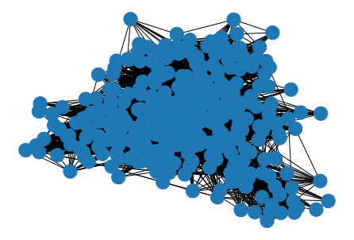
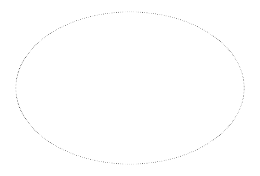
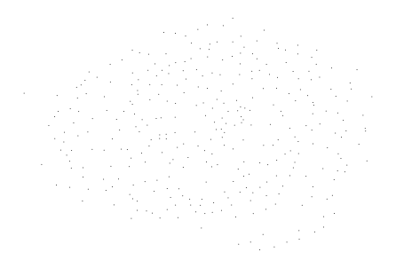
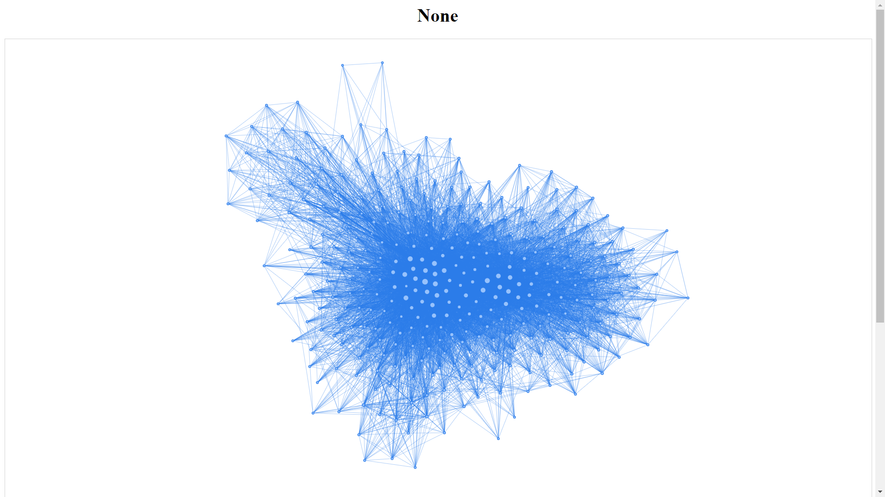
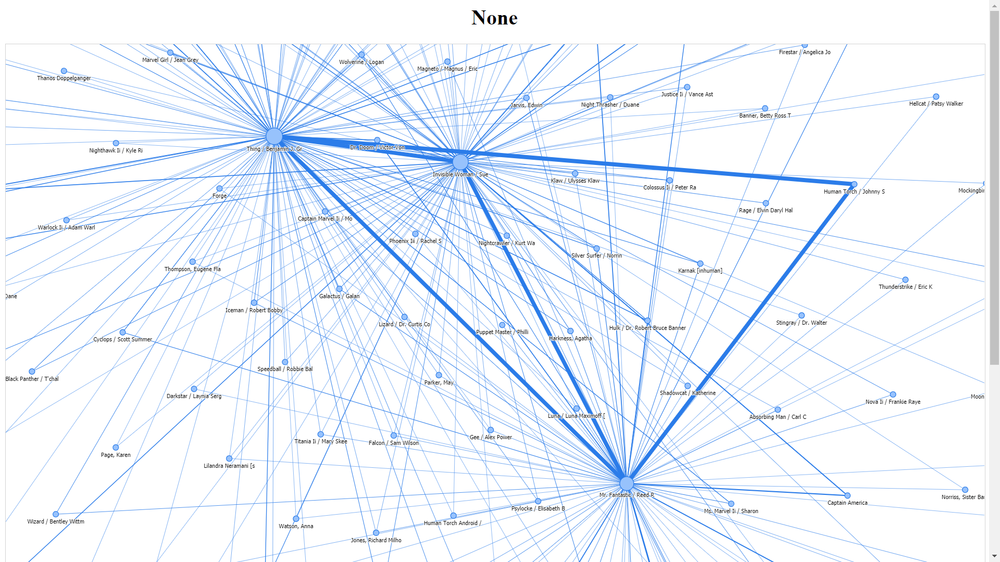

<h1>Banco de Dados - A2</h1>
<h4>Fundação Getúlio Vargas - Escola de Matemática Aplicada </br>
Bacharelado em Ciência de Dados </br>
Disciplina: Banco de Dados </br>
Professor: Renato Rocha Souza</br>
Alunos: Gianlucca Devigili e Maisa O. Fraiz</h4>

# Marvel Graph Database

## Importando os Dados:
Utilizamos a biblioteca pymsql para importar os dados do dataset: https://github.com/melaniewalsh/sample-social-network-datasets/tree/master/sample-datasets

Este dataset é um subset que contém todas as aparições em quadrinhos dos heróis da marvel. Ele contém 327 heróis e quase 10 mil conexões entre eles

```python
conn = pymysql.connect(host='localhost', port=3306, user='root', passwd = "root")
cur = conn.cursor()
cur.execute("use marveldb")
df_nodes = pd.read_sql("SELECT * FROM heroes;", conn)
df_edges = pd.read_sql("SELECT * FROM edges;", conn)
```

Os dados estão em duas tabelas:
Heroes, que contém o Id ou nome do herói

|     |                  Id     |                   Label |
|----:|------------------------:|------------------------:|
|  0  |  Black Panther / T'chal |  Black Panther / T'chal |
|  1  |        Loki [asgardian] |        Loki [asgardian] |
|  2  |    Richards, Franklin B |       Mantis / ? Brandt |
|  3  |   Iceman / Robert Bobby |   Iceman / Robert Bobby |
|  4  | Marvel Girl / Jean Grey | Marvel Girl / Jean Grey |
| ... |          ...            |                      ...|

e edges, que contém todas as conexões de cada herói, ou seja, indica quais heróis apareceram nos mesmos quadrinhos:

|  Id |                 Source |                  Target | Weight |
|----:|-----------------------:|------------------------:|-------:|
|   0 | Black Panther / T'chal |        Loki [asgardian] |     10 |
|   1 | Black Panther / T'chal |       Mantis / ? Brandt |     23 |
|   2 | Black Panther / T'chal |   Iceman / Robert Bobby |     12 |
|   3 | Black Panther / T'chal | Marvel Girl / Jean Grey |     10 |
|   4 | Black Panther / T'chal |  Cyclops / Scott Summer |     14 |
| ... |           ...          |           ...           |     ...|

## Criação do Grafo com Networkx

```python
G = nx.Graph()
#Adiciona os nós
for i, r in df_nodes.iterrows():
    G.add_node(r["Id"])

#Faz uma tupla com as arestas
edges_tuple = [(r["Source"], r["Target"]) for i, r in df_edges.iterrows()]
#Adiciona as arestas
G.add_edges_from(edges_tuple)
nx.draw(G)
```



Por termos usado as configurações default do networkx.draw(), o grafo ficou estéticamente ruim, então mudamos um pouco as opções de visualização:

```python
options = {
    "node_color": "black",
    "node_size": 1,
    "edge_color": "gray",
    "linewidths": 0,
    "width": 0.04,
}
nx.draw_circular(G, **options)
```


```
nx.draw_kamada_kawai(G, **options)
```



## Pyviz.Network
Contudo, o volume de dados ser grande, mesmo os grafo estando estéticamente bonito, ele não é capaz de dizer nada.

Portanto utilizamos a ferramenta Pyviz.network para gerar grafos interativos.
O primeiro plot é um com todos os heróis, ainda bastante carregado, então segmentamos os dados nos seguintes conjuntos:<br>
1. Heróis que aparecem em quadrinhos juntamente ao Quarteto Fantástico <br>
2. Heróis que aparecem em quadrinhos juntamente aos Avengers (primeiro filme) <br>
3. Heróis que aparecem em quadrinhos juntamente ao Professor Xavier (X-Men)

Abaixo segue o código comentado da ferramenta

```python
#Cria o grafo usando pyvis
marvel_net = Network(height="1250px", width="100%", bgcolor="#ffffff", font_color="black")
marvel_net.barnes_hut()

#Popula o grafo com nós e peso
sources = df_edges['Source']
targets = df_edges['Target']
weights = df_edges['Weight']

edge_data = zip(sources, targets, weights)

for e in edge_data:
    src = e[0]
    dst = e[1]
    w = e[2]
    
    marvel_net.add_node(src, src, title=src)
    marvel_net.add_node(dst, dst, title=dst)
    marvel_net.add_edge(src, dst, value=w)

neighbor_map = marvel_net.get_adj_list()

for node in marvel_net.nodes:
    node["title"] += " Neighbors:<br>" + "<br>".join(neighbor_map[node["id"]])
    node["value"] = len(neighbor_map[node["id"]])

#Personilização do grafo
marvel_net.toggle_physics(True)
marvel_net.set_options(''' var options = {
  "nodes": {
    "font": {
      "size": 20,
      "face": "tahoma",
      "strokeWidth": 3
    },
    "shapeProperties": {
      "borderDashes": false
    }
  },
  "edges": {
    "color": {
      "inherit": true
    },
    "font": {
      "face": "tahoma"
    },
    "smooth": false
  },
  "interaction": {
    "hover": true,
    "keyboard": {
      "enabled": true
    },
    "multiselect": true,
    "navigationButtons": true
  },
  "physics": {
    "barnesHut": {
      "gravitationalConstant": -85550,
      "centralGravity": 0.2,
      "springLength": 250,
      "springConstant": 0.001
    },
    "minVelocity": 0.75,
    "timestep": 0.2
  }
}
''')

#Gerando o html
marvel_net.show("marvel.html")
```



### Fantastic Four

```SQL
SELECT Source, Target, Weight
FROM edges 
WHERE Source IN ('Mr. Fantastic / Reed R', 'Invisible Woman / Sue', 'Thing / Benjamin J. Gr', 'Human Torch /  JohnnyS')
```



### Avengers

```SQL
SELECT Source, Target, Weight
FROM edges
WHERE Source IN ('Captain America', 'Iron Man / Tony Stark', 'Hulk / Dr. Robert Bruce Banner', 'Black Widow / Natasha', 'Thor / Dr. Donald Blak')
```


## Conclusão
A ferramenta gera um grafo animado onde os nós (heróis) possuem certa "gravidade" conforme seu peso, então aqueles que possuem gravidade maior estão ao centro do grafo. Enfatizando o Capitão América que é o herói com mais conexões.
Nos subsets que selecionamos, foi possível perceber, no caso do quarteto fantástico, que ele nem sempre aparece junto e que Tocha Humana é o herói com menos conexões dentre os quatro.
No caso dos avengers, um deles sequer apareceu no subset da autora, já que ele filtrou pelos heróis com mais conexões do dataset original (que passava de 19 mil heróis e mais de 96 mil conexões). Neste grafo podemos notar que os 5 heróis possuem um número parecido de conexões.
No grafo do professor Xavier, podemos notar que as conexões mais "fortes" dele são conexões com os X-men.
